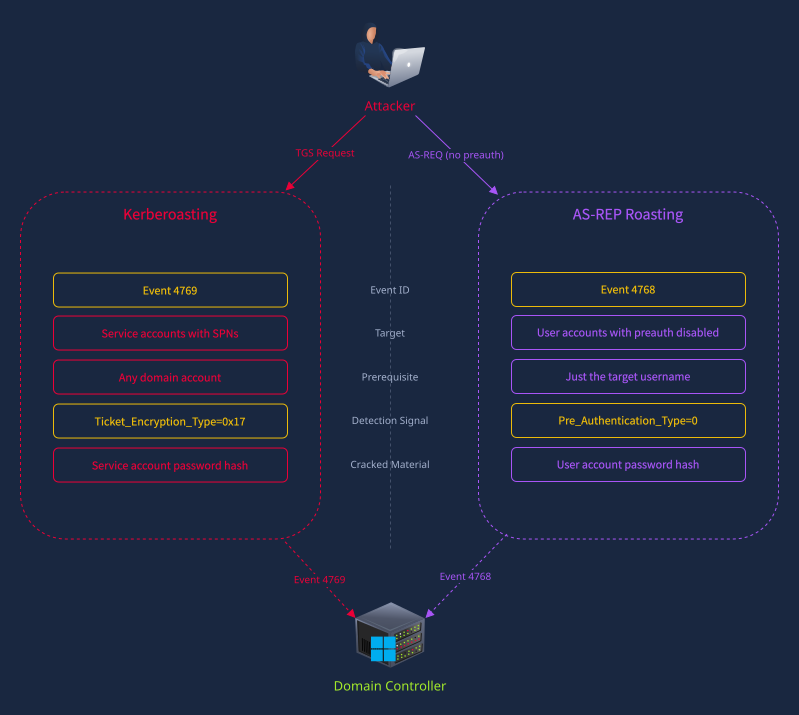

# Technical Study Guide: AS-REP Roasting Attack & Behavioral Detection

## 1. Executive Summary & Attack Concept
**AS-REP Roasting** is an initial access and credential access technique categorized under **MITRE ATT&CK [T1558.004](https://attack.mitre.org/techniques/T1558/004/) (Steal or Forge Kerberos Tickets: AS-REP Roasting)**.

Unlike Kerberoasting—which requires an attacker to already possess valid domain user credentials—**AS-REP Roasting requires zero domain credentials**. An attacker only needs **network visibility to a Domain Controller (Port 88)** and a list of valid **domain usernames**.

The attack exploits user accounts that have the Active Directory configuration flag **"Do not require Kerberos preauthentication"** (`DONT_REQ_PREAUTH`) enabled. When this flag is active, an attacker can directly request a Ticket Granting Ticket (TGT) for the user. The Domain Controller immediately returns an `AS-REP` response containing an encrypted payload locked with that user's **password hash**, which can be taken offline and brute-forced.

```text
                               AS-REP ROASTING FLOW

 [ Attacker ]                          [ Domain Controller / KDC ]           [ Offline Cracker ]
  (No Domain Credentials)
       │                                           │                                 │
       │ 1. AS-REQ (Target User, No Pre-Auth)      │                                 │
       ├──────────────────────────────────────────>│                                 │
       │                                           │                                 │
       │ 2. Check: Is DONT_REQ_PREAUTH set?        │                                 │
       │    Yes! Generate AS-REP                   │                                 │
       │                                           │                                 │
       │ 3. AS-REP (Contains payload encrypted     │                                 │
       │    with User's Password Hash)             │                                 │
       │<──────────────────────────────────────────┤                                 │
       │                                                                             │
       │ 4. Extract Encrypted Material ($krb5asrep$)                                 │
       ├────────────────────────────────────────────────────────────────────────────>│
       │                                                                             │
       │                                                   5. Hashcat / John Offline │
       │                                                      Brute-Force Dictionary │
       │                                                      (Cleartext Password)   │
```

---

## 2. Deep Dive: The Role of Kerberos Pre-Authentication

In normal Active Directory operations, **Kerberos Pre-Authentication (RFC 4120)** serves as the first line of defense against offline credential cracking:

1. **Standard Pre-Authentication Enabled (Normal Behavior):**
   - In a standard `AS-REQ`, the client must prove it knows the user's password *before* the KDC will provide any authentication data.
   - The workstation encrypts the current system timestamp with the user's password-derived secret key (`PA-ENC-TIMESTAMP`).
   - The KDC decrypts this timestamp. If it matches within the allowed clock skew (default 5 minutes), the KDC confirms identity and issues the TGT.
   - *Result:* An attacker cannot obtain any ciphertext to crack offline without already knowing the password.

2. **Pre-Authentication Disabled (`DONT_REQ_PREAUTH`):**
   - Active Directory provides an account setting: `Account Options -> "Do not require Kerberos preauthentication"`.
   - In AD attributes, this sets the `DONT_REQ_PREAUTH` bit (`0x400000` / decimal `4194304`) inside the `userAccountControl` attribute.
   - When set, anyone can send an `AS-REQ` containing only the target username.
   - **The KDC skips timestamp verification entirely** and immediately returns the `AS-REP`.
   - The `AS-REP` packet contains an encrypted section (encrypted with the target user's password hash) containing the ephemeral session key.
   - The attacker extracts this encrypted block and performs an **offline dictionary attack**.

> [!WARNING]
> Why would administrators enable this dangerous setting? Historically, it was configured for legacy UNIX systems, older custom non-Windows Kerberos clients, or legacy applications that did not implement the pre-authentication specification. Often, administrators forget to revert the setting or leave it enabled on stale administrative accounts.

---

## 3. High-Level Comparison: AS-REP Roasting vs. Kerberoasting

The diagram below highlights the differences in attack mechanics, target profiles, and detection signals:



| Feature | AS-REP Roasting | Kerberoasting |
| :--- | :--- | :--- |
| **Exploited Phase** | **AS Exchange (AS-REQ / AS-REP)** | **TGS Exchange (TGS-REQ / TGS-REP)** |
| **Event ID** | **Event 4768** | **Event 4769** (and 4768) |
| **Target Entities** | Accounts with **Pre-Authentication Disabled** | Service Accounts with **SPNs** |
| **Prerequisites** | **Just the target username** (No password needed) | **Any authenticated domain account** |
| **Detection Signal** | `Pre_Authentication_Type = 0` (or `0x0`) | `Ticket_Encryption_Type = 0x17` |
| **Cracked Material** | Target user account password hash | Target service account password hash |

---

## 4. Step-by-Step Attack Lifecycle

### Step 1: Identifying Vulnerable Accounts
Attackers find accounts where the `userAccountControl` property contains the `DONT_REQ_PREAUTH` flag.
- **Using Impacket `GetNPUsers.py` (Unauthenticated or with username wordlist):**
  ```bash
  # If attacker has no credentials, uses a username wordlist:
  GetNPUsers.py corp.local/ -usersfile users.txt -dc-ip 10.0.0.1 -format hashcat
  
  # If attacker has low-privileged credentials, queries LDAP automatically:
  GetNPUsers.py corp.local/guest_user:Welcome123 -dc-ip 10.0.0.1 -request
  ```
- **Using PowerView / PowerShell:**
  ```powershell
  Get-DomainUser -PreauthNotRequired | Select-Object samaccountname, useraccountcontrol
  ```

### Step 2: Extracting the AS-REP Hash
The KDC responds with an `AS-REP` packet containing the encrypted ticket block. Tools format this into standard hash formats:
```text
$krb5asrep$23$target_admin@CORP.LOCAL:36B4D8...$D08F...[Encrypted Ciphertext]...
```

### Step 3: Offline Cracking via Hashcat
Because the cracking occurs completely offline on the attacker's hardware, no Kerberos failure logs (`Event 4771` or `Event 4625`) are generated on the Domain Controller.
```bash
# Hashcat Mode 18200 = Kerberos 5, etype 23, AS-REP
hashcat -m 18200 asrep_hashes.txt /usr/share/wordlists/rockyou.txt -r rules/best64.rule
```

---

## 5. SOC Behavioral Detection: The "Smoking Gun" Correlation

A static signature looking only for `Pre_Authentication_Type = 0` in Event 4768 can result in false positives if legitimate legacy applications still operate without pre-authentication. 

To achieve high-confidence detection, SOC analysts evaluate the **authentication chain behavior**:


### The Two Behavioral Paths:

#### Path A: Legitimate User / Normal Authentication Chain
When a legitimate user with pre-auth disabled logs into their workstation:
1. **Event 4768 (TGT Request):** Emitted on the Domain Controller with `Pre_Authentication_Type = 0`.
2. **Event 4769 (TGS Request):** The user workstation immediately requests service tickets (e.g., for `HOST`, `CIFS`, or `LDAP`) to connect to network resources.
3. **Event 4624 (Logon Success):** Successful interactive or network logon recorded on the destination workstation or server.
- **Pattern:** `4768 → 4769 → 4624` (**Complete Authentication Chain**).

#### Path B: Attacker Conducting AS-REP Roasting
When an attacker performs AS-REP Roasting:
1. **Event 4768 (TGT Request):** Emitted on the Domain Controller with `Pre_Authentication_Type = 0`.
2. **No Follow-up Activity:**
   - **No Event 4769** is requested for that user.
   - **No Event 4624** logon occurs anywhere in the domain.
3. **The Signal:** `4768 → silence` (**Anomalous Incomplete Chain**).
   - The attacker only wanted the encrypted hash blob from the `AS-REP` packet to take offline. They never attempt to use the issued TGT on the network.

---

## 6. Detection Queries (SIEM & Threat Hunting)

### Microsoft Sentinel (KQL): Hunting for 4768 Followed by Silence
```kql
// Identify AS-REQ requests with pre-auth disabled that lack follow-up TGS requests (AS-REP Roasting pattern)
let timeframe = 1h;
let asrep_requests = 
    SecurityEvent
    | where TimeGenerated >= ago(timeframe)
    | where EventID == 4768
    | where PreAuthType == "0" or PreAuthType == "0x0" or PreAuthType == "-"
    | project ASReqTime = TimeGenerated, TargetUserName, ClientIP = IpAddress, DC = Computer;
let tgs_requests = 
    SecurityEvent
    | where TimeGenerated >= ago(timeframe)
    | where EventID == 4769
    | project TGSTime = TimeGenerated, TargetUserName;
asrep_requests
| join kind=leftanti (tgs_requests) on TargetUserName
| project ASReqTime, TargetUserName, ClientIP, DC, Detection = "AS-REP Roasting (4768 without subsequent 4769)"
```

### Splunk (SPL): Detecting Event 4768 with PreAuthType=0
```spl
index=wineventlog EventCode=4768 (Pre_Authentication_Type="0" OR Pre_Authentication_Type="0x0" OR Pre_Authentication_Type="-")
| eval is_machine=if(like(TargetUserName, "%$"), 1, 0)
| where is_machine=0
| stats count by TargetUserName, Client_Address, Computer, Ticket_Encryption_Type
| sort - count
```

### Elastic Security (EQL)
```eql
authentication where event.code == "4768" and
  winlog.event_data.PreAuthType in ("0", "0x0") and
  not winlog.event_data.TargetUserName: "*$"
```

---

## 7. Prevention, Auditing & Remediation

1. **Audit Active Directory for Pre-Auth Disabled Accounts:**
   Run PowerShell to find all vulnerable accounts across the domain:
   ```powershell
   Get-ADUser -Filter {DoesNotRequirePreAuth -eq $True} -Properties DoesNotRequirePreAuth, Description |
     Select-Object SamAccountName, Enabled, Description
   ```
2. **Enforce Kerberos Pre-Authentication:**
   Disable the flag immediately on all identified user accounts:
   ```powershell
   Set-ADUser -Identity "target_username" -DoesNotRequirePreAuth $False
   ```
3. **Force Immediate Password Reset:**
   - Any account that had pre-authentication disabled must be treated as compromised. Force an immediate password reset to invalidate any offline cracking attempts.
4. **Strong Passwords & Passphrases:**
   - Enforce minimum length (20+ characters) or passphrases so that even if an AS-REP is extracted, offline dictionary attacks will fail.
5. **Enable MFA:**
   - Multi-Factor Authentication prevents attackers from utilizing cracked credentials at network and identity perimeters.

