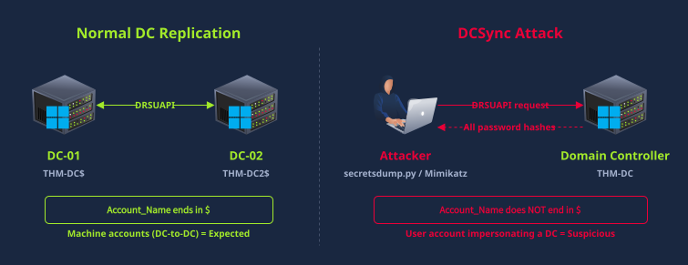

## Detecting DCSync
Imagine the attacker has Domain Admin credentials. Maybe they cracked a Kerberoasted service account that happened to be a Domain Admin, or they dumped LSASS on a machine where a Domain Admin had an active session. Either way, they now have the highest level of access in the domain. The question is what they do with it
Attackers target DCSync because it lets them extract every password hash in the domain without touching the domain controller's disk, without creating volume shadow copies, and without needing physical access to the DC . It works by abusing the Active Directory replication protocol (DRSUAPI), the same protocol that legitimate domain controllers use to synchronize directory data with each other. The attacker's machine pretends to be a domain controller and requests password data via DRSUAPI. If their account has the right permissions, the real DC complies. Domain Admins, Enterprise Admins, and DC machine accounts have these replication rights by default.
In some environments, attackers can also obtain replication ACL rights through abuse (WriteDACL on the domain object) without ever joining the Domain Admins group.
### How DCSync Works
Active Directory replication is built on a set of extended rights that control who can request directory data. Three specific GUIDs are relevant:

* ``{1131f6ad-9c07-11d1-f79f-00c04fc2dcd2}`` is DS-Replication-Get-Changes-All
* ``{1131f6aa-9c07-11d1-f79f-00c04fc2dcd2}`` is DS-Replication-Get-Changes
* ``{89e95b76-444d-4c62-991a-0facbeda640c}`` is DS-Replication-Get-Changes-In-Filtered-Set
The one that matters most is ``1131f6ad``, which is DS-Replication-Get-Changes-All. This is the permission that allows pulling password data, and it's the primary indicator of DCSync.
### Detection with Event 4662
DCSync detection uses Event 4662 (An operation was performed on an object), which is part of Directory Service Access auditing. When someone exercises the replication extended rights on the domain partition, Event 4662 fires with the replication GUID embedded in the raw event data.
| Field | What It Contains | Why It Matters |
| --- | --- | --- |
| user | The account performing the replication | Identifies who is running DCSync |
| Access_Mask | 0x100 (Control Access) | Indicates an extended right was exercised |
| Properties | Shows "Control Access" (GUIDs in raw event) | The replication GUIDs confirm DCSync |
| Logon_ID | Hex session identifier | Links to 4624 logon event for source IP correlation |

The detection signal is an Event 4662 with ``Access_Mask=0x100``, the replication GUIDs present in the raw event data, and a user that isn't a machine account (doesn't end in $).

``Warning``: Event 4662 for DCSync detection requires TWO things to be configured in advance: (1) "Audit Directory Service Access" must be enabled via Group Policy, and (2) a SACL (System Access Control List) must be set on the domain partition to audit replication operations. Neither is enabled by default. Without both of these, DCSync is completely invisible in the logs. This is one of the most common detection gaps in real environments, and it's worth verifying in any network you're responsible for.
### Normal vs Suspicious Replication
In a production environment with multiple domain controllers, Event 4662 events with replication GUIDs are completely normal. Domain controllers replicate constantly. The distinction between normal and malicious is the source, as shown in the diagram below:

| Pattern | Normal | Suspicious |
| --- | --- | --- |
| user | Machine account ending in $ (e.g., THM-DC$) | Human user account (not ending in $) |
| Source host | Another domain controller | A workstation or non-DC server |
| Frequency | Regular intervals matching replication schedule | One-time or burst of requests |
| Scope | Specific partition changes | Requesting all credentials (-just-dc-ntlm or full dump) |