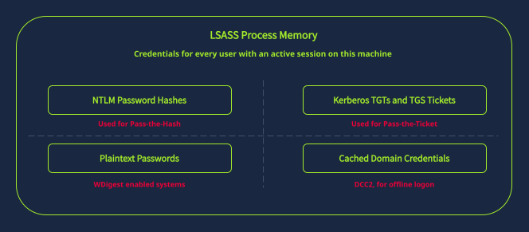
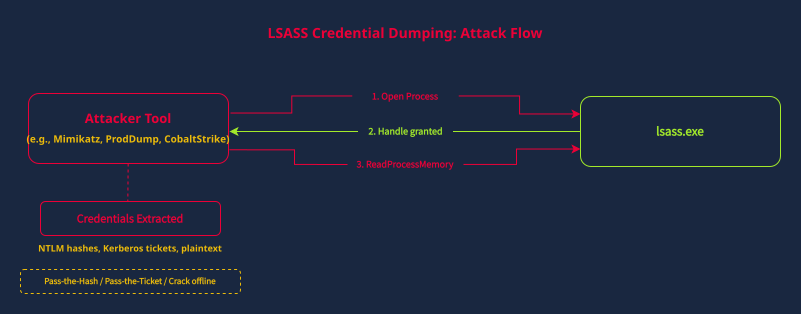
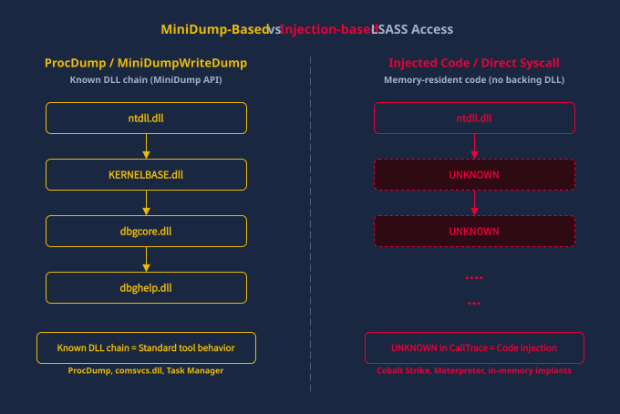

## Detecting LASASS Credential Dumping/
So far, we've been working with Kebros events on the domain controller to detect attacks that crack passwords offline.LSASS dumping is different. It's a direct credential theft technique that happens on the endpoint where the credentials are stored, and detecting it requires a completely different approach.

Attackers target LSASS (Local Security Authority Subsystem Service) because it stores credentials for every user who has authenticated to the machine. If a domain admin logged into a workstation earlier that day, their NTLM hash and Kerberos tickets are sitting in LSASS memory. An attacker who dumps LSASS on that machine gets those credentials immediately, no cracking required.

Let's think like an attacker. We've Kerberoasted some service accounts in the previous task, but none had domain admin privileges. So what would we do next?
There are different approaches attackers can take, but one of them is finding a machine where a DA or any account with higher privileges has an active session. Dumping LSASS is the next escalation path.
### What LSASS Stores
LSASS holds different types of credentials depending on the Windows version and configuration:
* NTLM password hashes for all authenticated users
* Kerberos tickets (TGTs and TGS tickets) for active sessions
* Plaintext passwords on systems where WDigest is enabled (Windows 8/Server 2012 and earlier by default, or any newer version where the ``UseLogonCredential`` registry value has been set to ``1``)
* Cached domain credentials for offline logon

#### WDigest?
WDigest (Digest Authentication) is a legacy authentication protocol introduced by Microsoft in Windows XP and Windows Server 2003 to allow users to authenticate against web applications using HTTP Digest Authentication.
##### The Fundamental Flaw
To calculate the HTTP MD5 digest hash when a user logs in, WDigest requires access to the user's password in plaintext.
Because of this design, when WDigest authentication was enabled:  
* __Memory Storage__: The Windows Local Security Authority Subsystem Service (lsass.exe) was forced to retain user passwords in cleartext (plaintext) in RAM.  
* __Easy Dumping__: If an attacker achieved local administrator or SYSTEM access on a machine (or compromised a Domain Controller), they could dump lsass.exe using tools like Mimikatz (sekurlsa::wdigest) and immediately read every logged-in user's password in plain text.
###### The Registry Switch
To check or force WDigest plaintext caching off:
* __Registry Path:__ HKLM\System\CurrentControlSet\Control\SecurityProviders\WDigest
* __DWORD Value Name__: UseLogonCredential
* __Setting__: 0 (Disabled - Secure), 1 (Enabled - Exposes Plaintext Passwords)    

If an attacker dumps LSASS, they can use NTLM hashes to crack them offline, use them in Pass-the-Hash attacks, or dump Kerberos tickets for Pass-the-Ticket attacks. These are lateral movement techniques with their own detection artifacts. For now, our focus is on detecting the dump itself. The diagram below illustrates the LSASS dumping attack flow: 

### Detection With Sysmon Event 10
Sysmon Event 10 (ProcessAccess) fires when one process opens a handle to another process. When a tool like Mimikatz or ProcDump accesses lsass.exe,Sysmon records exactly which process did it, what level of access it requested, and the call stack that led to the access. For a deeper dive into LSASS access detection patterns, the Splunk Threat Research Team's article [You Bet Your Lsass: Hunting LSASS Access](https://www.splunk.com/en_us/blog/security/you-bet-your-lsass-hunting-lsass-access.html) is an excellent resource.

__Warning__: Sysmon Event 10 only logs process access when the Sysmon configuration includes explicit ProcessAccess rules targeting lsass.exe. The default Sysmon installation does NOT log these events. If your environment uses a minimal Sysmon config, LSASS dumping will be invisible to Sysmon.

| Field | What It Contains | Why It Matters |
| --- | --- | --- |
| SourceImage | Full path of the process accessing LSASS | Identifies the tool used for the dump |
| SourceUser | The user account running the source process | Identifies the compromised account. SYSTEM is expected; a domain user account is suspicious |
| TargetImage | Full path of the target process (lsass.exe) | Confirms LSASS was the target |
| GrantedAccess | Hex access mask showing requested permissions | Different tools request different access levels |
| CallTrace | DLL call stack leading to the access | Reveals the method used (MiniDump API, injection, etc.) |

### Understanding the GrantedAccess Field
The GrantedAccess value is a hex bitmask built by adding together individual process access rights (opens in new tab). Understanding how these values are composed helps when you encounter an unfamiliar access mask in the field:
| Access Right | Hex Value | Purpose |
| --- | --- | --- |
| PROCESS_QUERY_LIMITED_INFORMATION | 0x1000 | Query basic process info |
| PROCESS_QUERY_INFORMATION | 0x0400 | Query detailed process info |
| PROCESS_VM_READ | 0x0010 | Read process memory |
| PROCESS_ALL_ACCESS | 0x1FFFFF | Full access to the process |

For example, ``0x1010`` = ``0x1000`` (PROCESS_QUERY_LIMITED_INFORMATION) + ``0x0010`` (PROCESS_VM_READ). The 0x0010 bit is what matters for credential dumping, because reading LSASS process memory is how credentials are extracted.

In practice, ``0x1010`` is associated with Mimikatz, and ``0x1FFFFF`` (PROCESS_ALL_ACCESS) with ProcDump, comsvcs.dll, and Task Manager.

### Understanding the CallTrace Field
The CallTrace field shows the chain of Dll calls that led to the LSASS access, and it can distinguish between different dump methods:

* __Known DLLs__ like dbgcore.dll and dbghelp.dll indicate the MiniDump API was used. This is how ProcDump and comsvcs.dll create memory dumps. It's a legitimate API being used for a malicious purpose.
* __UNKNOWN memory offsets__ (addresses not mapped to any known DLL) indicate injected code. This is the signature of Cobalt Strike beacons, Meterpreter, and other in-memory implants that access LSASS from injected shellcode.

To make this concrete, here's what each pattern looks like in a real CallTrace value:

__MiniDump-based (ProcDump/comsvcs.dll)__:
```bash
C:\Windows\SYSTEM32\ntdll.dll+9D4C4|C:\Windows\System32\KERNELBASE.dll+2B16D|C:\Windows\System32\dbgcore.dll+A3C8|...
```
__Injection-based (e.g., Cobalt Strike)__:
```bash
C:\Windows\SYSTEM32\ntdll.dll+9D4C4|UNKNOWN(0000025FA0120000)|UNKNOWN(0000025FA0124B30)|...
```
The diagram below provides a visual comparison of these two CallTrace patterns:

The distinction matters because it tells you what kind of attacker you're dealing with. A ProcDump-based dump suggests a hands-on-keyboard attacker using LOLBins (legitimate tools for malicious purposes). An injection-based dump suggests a more sophisticated implant.
### What Normal Looks Like
| Full Process Path | Typical GrantedAccess | Why |
| --- | --- | --- |
| C:\Windows\System32\csrss.exe | 0x1000 or 0x1400 | Windows subsystem, manages processes |
| C:\Windows\System32\WerFault.exe | 0x1000 | Windows Error Reporting crash handler |
| C:\Windows\System32\svchost.exe | 0x1010 | Various service functions (normal at this access level) |
| AV/EDR agent paths | Varies | Security products monitor LSASS for protection |

__Note:__ When filtering out legitimate processes during investigation, always match on the full path, not just the executable name. An attacker can name their tool svchost.exe and place it in ``C:\Users\Public\`` or ``C:\Temp\.`` The process name looks legitimate, but the path gives it away. The same logic applies to ``csrss.exe, WerFault.exe``, and any other system process. If the ``SourceImage ``path isn't ``C:\Windows\System32\``, treat it as suspicious regardless of the file name. This also means that access masks that are associated with credential dumping tools aren't automatically malicious. It all depends on context: which process is accessing LSASS, and why.

Table of those legimate DLL's working that are used in Procdump
| DLL Name | Path | Primary Purpose & Role in LSASS Dumping | Threat Level / Analysis |
| --- | --- | --- | --- |
| **`ntdll.dll`** | `C:\Windows\System32\ntdll.dll` | NT Layer DLL that handles user-mode execution and translates API requests into kernel-mode system calls (`syscall`). | **Normal System Component** — Appears at the top/bottom of almost every call trace as it bridges user code to the Windows kernel. |
| **`KERNEL32.DLL`** / **`KERNELBASE.dll`** | `C:\Windows\System32\KERNEL32.DLL` | Core Windows OS libraries providing standard process management APIs (such as `OpenProcess`). | **Normal System Component** — Essential subsystem libraries used by binaries to request handle permissions from Windows. |
| **`dbgcore.dll`** / **`dbghelp.dll`** | `C:\Windows\System32\dbgcore.dll` | Windows Debugging Core Library containing the built-in `MiniDumpWriteDump` API[cite: 7]. | **Key Indicator** — Its presence in a call trace targeting `lsass.exe` reveals the MiniDump API was used to extract LSASS memory (e.g., via ProcDump or `comsvcs.dll`)[cite: 7]. |
| **`UNKNOWN`** *(Not a DLL)* | Memory-only address (e.g., `UNKNOWN(00000...)`) | Indicates code executing directly out of dynamically allocated/unbacked memory space[cite: 7]. | **CRITICAL / Malicious** — Points to in-memory process injection, C2 beacons (like Cobalt Strike or Meterpreter), or raw shellcode execution without a file on disk[cite: 7]. | 

### Important Splunk queries 
#### 1. Broad LSASS Access Overview Query

```splunk
index=* EventCode=10 TargetImage="*\\lsass.exe"
| stats count by SourceImage, GrantedAccess
```
#### 2. Detailed CallTrace and Context Inspection Query for Suspicious Processes
```splunk
index=* EventCode=10 TargetImage="*\\lsass.exe" SourceImage="{SUSPICIOUS_PROCESS}"
| table _time, SourceImage, SourceUser, GrantedAccess, CallTrace
```
