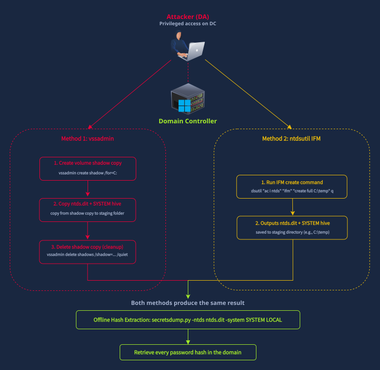

DCSync works remotely and blends in with replication traffic. But it's not the only way attackers extract credentials from Active Directory. Before DCSync became the standard, attackers copied the ``NTDS.dit`` file directly from the domain controller. This older approach is noisier, but it's still actively used in real intrusions.
## How NTDS.dit Extraction Works
The ``NTDS.dit`` file is the Active Directory database stored on every domain controller (typically at ``C:\Windows\NTDS\ntds.dit``). It contains password hashes for every account in the domain. The problem for attackers is that Windows locks this file while AD DS is running, so it can't be copied directly. Attackers use two main workarounds:

__Volume Shadow Copy (vssadmin)__: Creates a point-in-time snapshot of the filesystem, bypassing the file lock. The attacker creates a shadow copy, copies ntds.dit and the ``SYSTEM`` registry hive (needed to decrypt the hashes) from the snapshot, then deletes the shadow copy.

Typical command sequence:
```bash
C:\Windows\System32> vssadmin create shadow /for=C:
C:\Windows\System32> copy \\?\GLOBALROOT\Device\HarddiskVolumeShadowCopy1\Windows\NTDS\ntds.dit C:\temp\ntds.dit
C:\Windows\System32> copy \\?\GLOBALROOT\Device\HarddiskVolumeShadowCopy1\Windows\System32\config\SYSTEM C:\temp\SYSTEM
C:\Windows\System32> vssadmin delete shadows /shadow={shadow-id} /quiet
```
Install From Media / ntdsutil: A legitimate AD management tool designed for domain controller promotion. Attackers abuse the IFM (Install From Media) feature to produce a clean copy of ntds.dit and the SYSTEM hive, saving them to a local directory.

Typical command:
```bash
C:\Windows\System32> ntdsutil "ac i ntds" "ifm" "create full C:\temp" q q
```
Both methods require privileged access on the domain controller. ``vssadmin`` needs local admin rights, while ``ntdsutil`` requires Domain Admin or equivalent AD DS permissions. Both produce the same result: an offline copy of the AD database that can be parsed with tools like ``secretsdump.py`` or ``NTDSDumpEx`` to extract all password hashes. The diagram below shows both extraction paths:

#### Detecting NTDS.dit Extraction=

NTDS.dit extraction is detected through process creation events. We're looking for vssadmin.exe or ntdsutil.exe being executed on a domain controller with command-line arguments related to shadow copies or IFM.

__Sysmon Event 1 (Process Creation)__ captures the full command line. The detection signals are:

* ``ntdsutil.exe`` with a command line containing ifm and create
* ``vssadmin.exe`` with a command line containing create shadow
``Sysmon Event 11`` (File Creation) captures when ``ntds.dit`` is written to an unusual location by ``ntdsutil.exe``