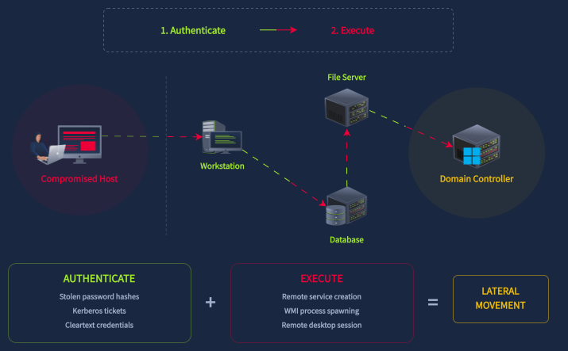
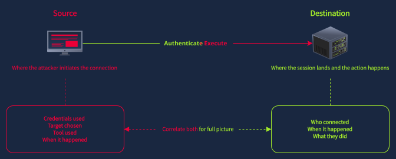
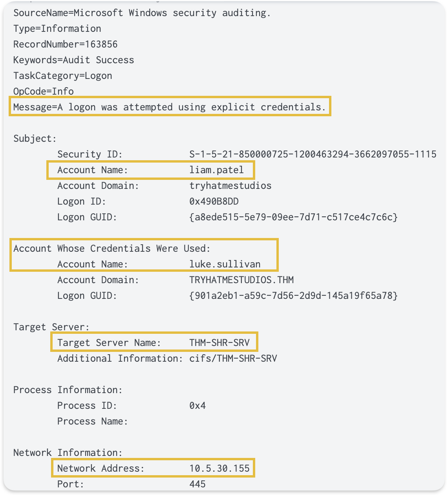
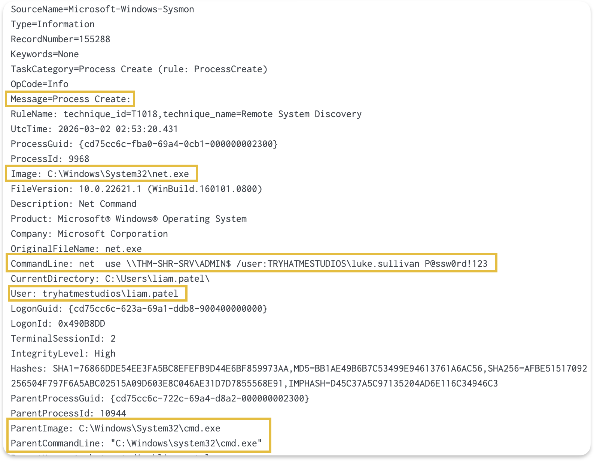

Now that we've seen the discovery phase, let's talk about what happens after the attacker has mapped out the network. They know which servers exist, which accounts have admin rights, and which machines are worth targeting. Their next step is to move to those targets so they can get closer to what they actually want, whether that's the Domain Controller, a database server, or a file share containing sensitive data.

Every lateral movement technique follows the same basic pattern, where the attacker authenticates to a remote machine using stolen or misused credentials, then executes something on it. The technique might differ, but that authenticate-then-execute sequence is always there.

Diagram showing the authenticate-then-execute pattern of lateral movement after the discovery phase

### The Source and Destination Model

Every remote connection creates artifacts on two machines:

* One is the source, where the attacker initiates the connection. It also only sees which credentials were used and which target was chosen.
* The other is the destination, where the session lands and the action happens. The destination sees that someone connected and what they did.
If we only check the destination, we know the attack happened, but might not know where it originated. If we only check the source, we know the intent but not whether it succeeded.

### Logon Type: The First Thing to Check
When someone connects to a remote machine, Windows logs Event 4624 on the destination. The ``Logon_Type`` field tells us how they connected.
| Logon Type | Meaning | Common Protocol | What It Tells Us |
| --- | --- | --- | --- |
| 3 | Network logon | SMB, PsExec | Remote access without an interactive session |
| 7 | Unlock/Reconnect | RDP | Session reconnect or workstation unlock |
| 10 | RemoteInteractive | RDP | Full desktop session |

Type 10 is straightforward because it always means RDP. Type 3 is trickier because SMB and PsExec both generate Type 3 logons, so we need additional artifacts to tell them apart. We'll cover those in the upcoming tasks.

__``NOTE``__ : If an attacker connects via ``RDP`` while the same account already has an active or disconnected session on that host, Windows reconnects them to the existing session instead of creating a new one. This generates a Type 7 (Unlock) logon instead of Type 10. During an investigation, if we see a Type 7 with a remote IP address ``(not 127.0.0.1)``, that indicates an RDP reconnection, not a physical workstation unlock. Keep this in mind when searching for RDP activity: filtering only for ``Logon_Type=10`` will miss these reconnections. Also note that a reconnection assigns a new ``Logon_ID`` even though the RDP session itself persists, so ``Logon_ID-based`` correlation can break at disconnect/reconnect boundaries

#### Event 4648: Tracing the Source
Event 4648 (Logon Using Explicit Credentials) fires on the **source** machine when a process uses credentials other than those of the currently logged-in user.[cite: 2]

For example, as shown in the screenshot below, if `liam.patel` runs `net use \\THM-SHR-SRV\ADMIN$ /user:luke.sullivan`, Event 4648 is logged on `THM-MKT-WS` and records the original account (`liam.patel`), the alternate account (`luke.sullivan`), and the target server name (`THM-SHR-SRV`)

Event 4648 showing explicit credential usage with original account liam.patel and alternate account luke.sullivan

This tells us directly which machine initiated the connection and what credentials were used. Most destination-side logs only show who connected, not who was sitting at the keyboard when the event occurred.

Sysmon Event 1 (Process Creation) also captures the ``net.exe`` process with the full command line, including the target server and the account specified in the ``/user:`` flag and the password.

Together, these two source-side events provide better context for the same activity.

__``Warning:``__ Event 4648 only fires when credentials are explicitly provided, such as with ``net use /user:``, ``runas``, or entering credentials in an RDP dialog. It doesn't fire for Pass-the-Hash, Pass-the-Ticket, or Kebros single sign-on, because those techniques reuse cached credentials without explicitly providing them.
### Normal vs Suspicious: Same Events, Different Context

A legitimate admin session and an attacker's lateral movement generate the same Event id. Both produce Event 4624, both can generate Event 4648, and both are "successful authentication to a remote host." What separates them is context.
| Factor | Likely Legitimate | Worth Investigating |
| --- | --- | --- |
| Source | IT admin workstation (THM-IT-DESK) | Marketing workstation (THM-MKT-WS) |
| Account | luke.sullivan (IT admin) | michelle.smith accessing admin shares |
| Time | Business hours | 2 AM on a Saturday |
| Target | Servers the admin normally manages | Workstation-to-workstation connections |
| Pattern | Single server, sustained session | Rapid connections to many servers |

### Why Lateral Movement Succeeds
Lateral movement mainly works because of common misconfigurations:

* Password reuse across local admin accounts means that a compromised credential can unlock many machines (Microsoft LAPS is designed to prevent this)
* Shared administrative accounts
* Overly permissive group memberships
* Bad network Segmentation between hosts
* Leaving RDP enabled on machines that don't need it widens the attack surface

A single compromised credential can unlock an entire network when these misconfigurations exist. Detection is important, but hardening the environment to limit where credentials can be used is just as valuable.