# SOC Analysis Lab: Windows Event Logs & Sysmon

## Objective
To analyze Windows and Sysmon logs to identify adversary tactics, techniques, and procedures (TTPs). The focus was on differentiating between baseline system behavior and anomalous activity indicating a security breach.

---

## Environment & Tools

### 1. Data Sources (Logs)
To perform a complete reconstruction of the events, the following Windows Event Log files from the TryHackMe lab were analyzed:
* **Security.evtx**: Utilized to identify successful/failed logons and account management activity (e.g., Event ID 4624/4625).
* **System.evtx**: Utilized to monitor system-level events, such as service starts and hardware changes.
* **Practice-Sysmon.evtx**: Utilized for granular visibility into process creation, network connections, and file modifications.

### 2. Analysis Tools
The investigation was conducted using the following tools and techniques:
* **Windows Event Viewer (eventvwr.msc)**: The primary GUI tool used for log visualization and manual inspection.
* **XPath/XML Filtering**: Used to isolate specific event IDs and filter through large volumes of log data.
* **CLI Investigation**: Manual review of PowerShell history files to identify command-line activity.

---

## Lab Execution & Findings

### Part 1: Security Log Analysis (`practice-security.evtx`)

In this section, we analyzed the security logs to identify unauthorized access and account manipulation.

**Q1: Which IP performed a brute force of the THM-PC?**
We applied a filter for **Event ID 4625** (Failed Logon) to isolate failed authentication attempts. By using the "Find" tool to search for "THM-PC," we identified a high volume of failed attempts originating from a specific source.

* **Answer**: `10.10.53.248`

**Q2: Which user has been breached as a result of the attack?**
Reviewing the same failed logon logs, we observed the transition from failed attempts to a successful entry on a specific account.

* **Answer**: `Administrator`

**Q3: What was the Logon ID of the malicious RDP login?**
We filtered the logs for **Event ID 4624** (Successful Logon) and looked for **Logon Type 10**, which indicates a Remote Desktop (RDP) session.

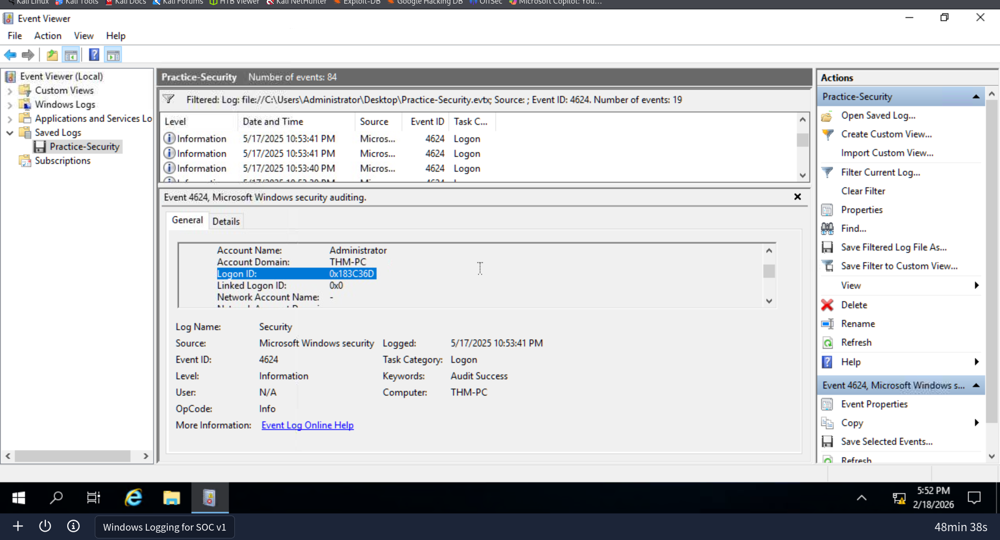

* **Answer**: `0x183C36D`

**Q4: Which user was created by the attacker soon after the RDP login?**
To identify account creation, we filtered for **Event ID 4720**. We cross-referenced the first creation log with the malicious Logon ID `0x183C36D`.

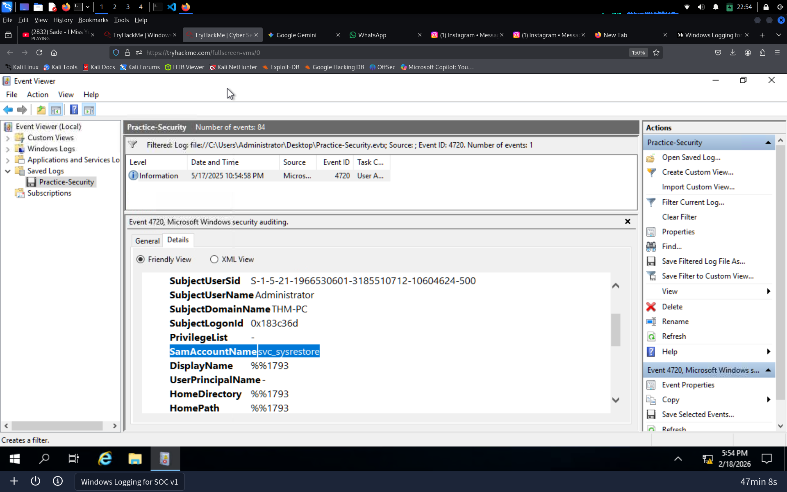

* **Answer**: `svc_sysrestore`

**Q5: Which two privileged groups was the backdoor user added to?**
We utilized **Event ID 4732** (A member was added to a security-enabled local group) and filtered for the same session Logon ID. 

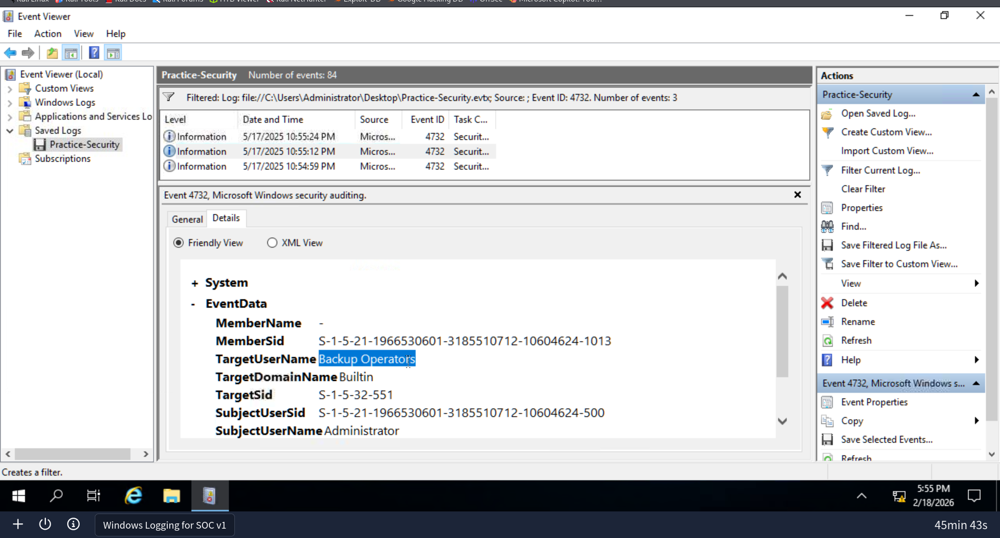

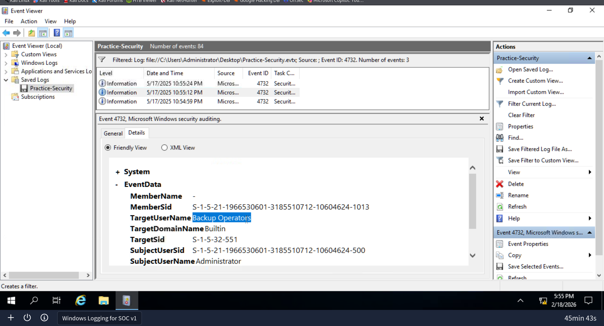

* **Answer**: `Backup Operators, Remote Desktop Users`

**Q6: Does the Logon ID field match what you saw in the previous task (Yea/Nay)?**

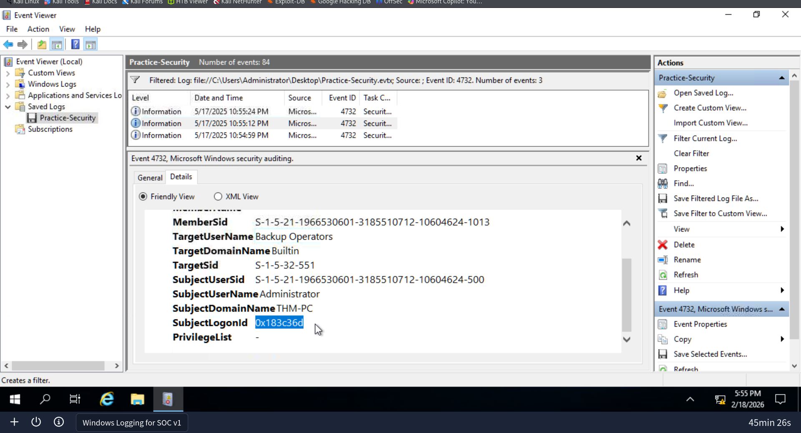

* **Answer**: `Yea`

---

### Part 2: Sysmon Analysis (`Practice-Sysmon.evtx`)

In this section, we transitioned to Sysmon logs to track file-level activity and network communications.

**Q1: Which web browser does Sarah use to browse the web?**
We filtered for **Event ID 15** (FileCreateStreamHash) to view file streams and searched for the user "Sarah." The logs explicitly listed the browser process.

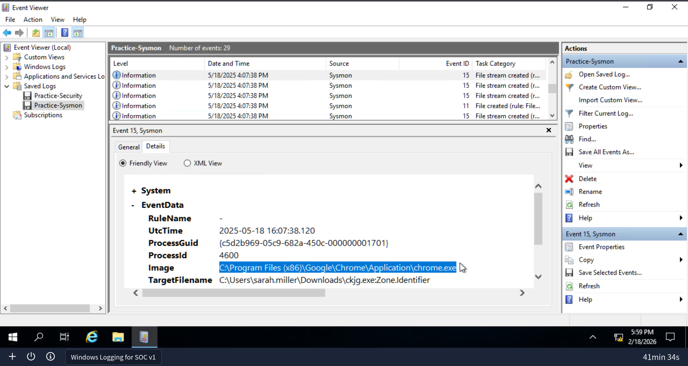

* **Answer**: `Google Chrome`

**Q2: Which file did Sarah download from the browser?**
By analyzing **Event ID 11** (File Created) and correlating it with the browser activity, we identified the downloaded executable.

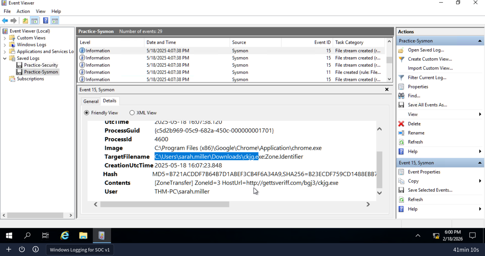

* **Answer**: `C:\Users\sarah.miller\Downloads\ckjg.exe`

**Q3: Which URL was the file downloaded from?**
We analyzed **Event ID 15** logs to find the "Mark of the Web" metadata, which contained the source URL.

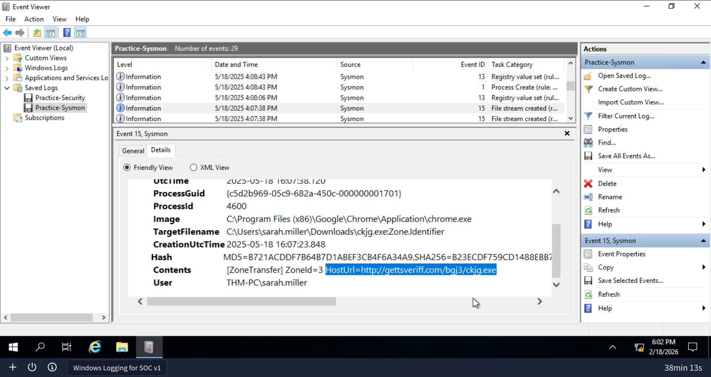

* **Answer**: `http://gettsveriff.com/bgj3/ckjg.exe`

**Q4: Which file was created by the downloaded malware to persist on the host?**
Using **Event ID 11**, we searched for files created shortly after the execution of the malware, specifically looking for locations like the Startup folder.

* **Answer**: `C:\Users\sarah.miller\AppData\Roaming\Microsoft\Windows\Start Menu\Programs\Startup\DeleteApp.url`

**Q5: What is the Command & Control (C2) server malware connected to?**
We monitored **Event ID 3** (Network Connection). Knowing the malicious Process ID (1460), we isolated the external connection.

* **Answer**: `193.46.217.4:7777`

**Q6: Finally, which domain does the malicious IP correspond to?**
Since DNS is required to resolve C2 domains, we filtered for **Event ID 22** (DNS Query) to identify the domain mapping for the malicious IP.

* **Answer**: `hkfasfsafg.click`

---

### Part 3: Forensic Review of PowerShell History

This section focused on discovering threat actor activity by reviewing the `ConsoleHost_history.txt` file.

**Q1: Which PowerShell command was executed first?**
We navigated to the PSReadline directory and opened the history file to review the command sequence.

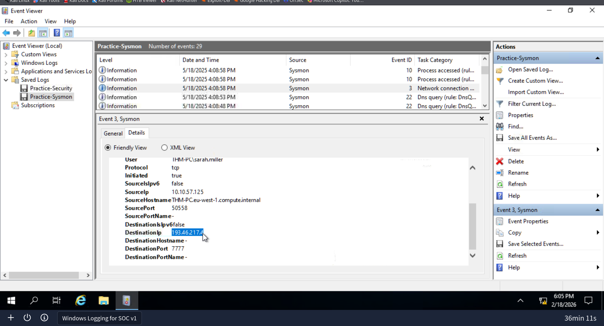

* **Answer**: `Get-ComputerInfo`

**Q2: When did the Administrator run the first PS command?**
By reviewing the file properties of the history file, we identified the creation/modification date.

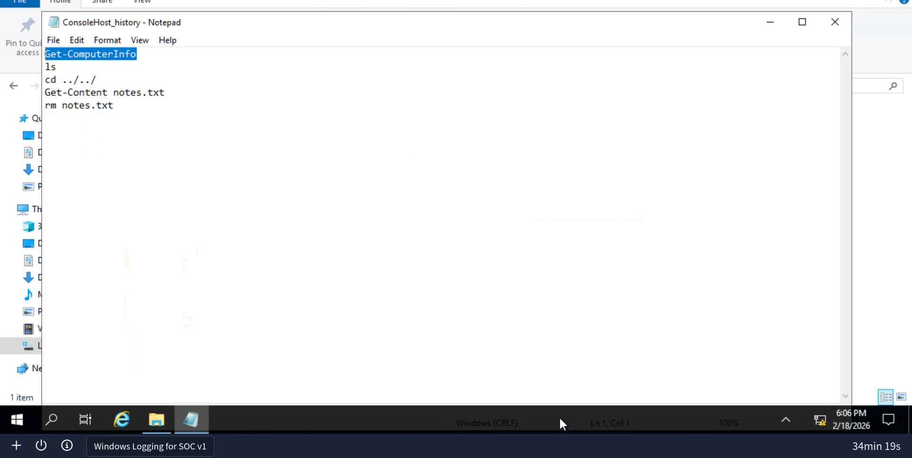

* **Answer**: `May 18, 2025`

**Q3: Can you find the flag stored in the PowerShell history?**
We checked the PowerShell history for other local users, specifically `thm.bob`.

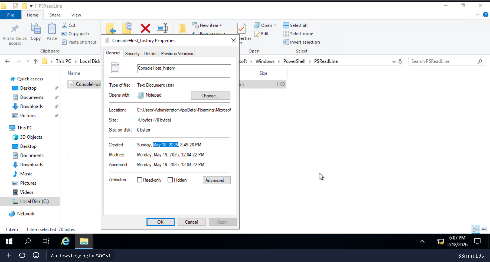

* **Answer**: `THM{it_was_me!}`

---

## Conclusion & Lessons Learned

### Summary of Investigation
The investigation successfully mapped an attack lifecycle from initial access via RDP brute force to persistence through a malicious startup file. By correlating Windows Security logs with Sysmon activity, we were able to identify the exact point of compromise and the subsequent lateral movement/persistence steps taken by the adversary.

### Key Takeaways
* **Log Correlation**: Using the **Logon ID** is the most effective way to track an attacker's activity across different log types.
* **Sysmon Visibility**: Standard Windows logs missed the source URL of the download, but **Sysmon Event ID 15** provided the critical "Mark of the Web" metadata.
* **Artifact Locations**: PowerShell history serves as a high-value forensic artifact that can reveal attacker intent even when event logs are missing.

### Recommended Remediation
1. **Account Hardening**: Enforce Multi-Factor Authentication (MFA) for RDP sessions to prevent brute force success.
2. **Persistence Monitoring**: Implement alerts for new file creations within the `\Startup\` and `\AppData\Roaming\` directories.
3. **Domain Blocking**: Block the identified malicious C2 domain (`hkfasfsafg.click`) at the firewall/DNS level.